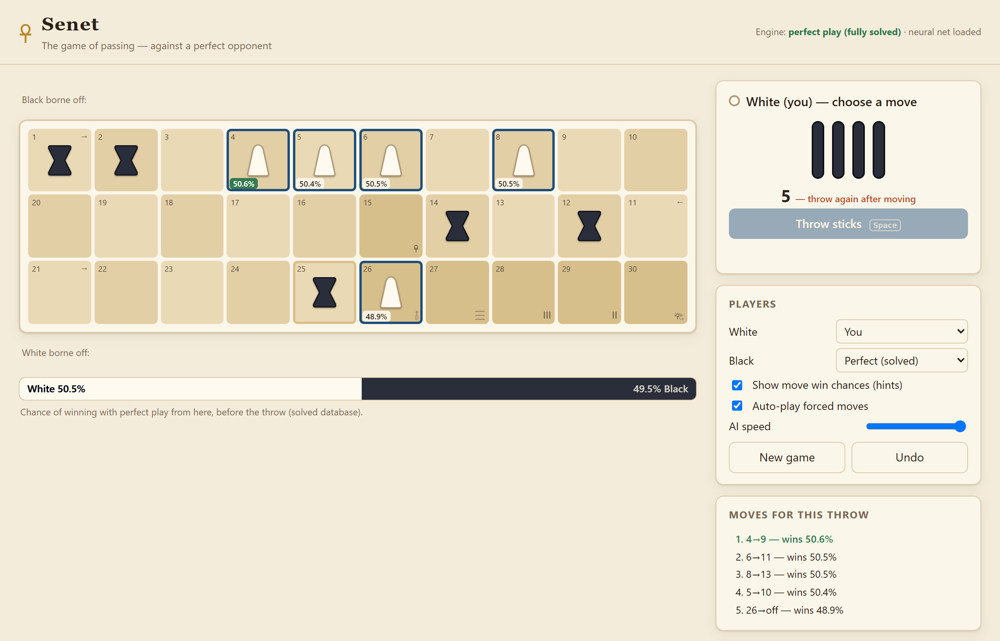

# Senet, solved

Senet is one of the oldest known board games: a race game for two, played in Egypt from
about 3000 BC, with throwing sticks for dice. This repository solves it under the Modern
Kendall rules with 5 pieces per side ([RULES.md](RULES.md)). For each of the
8,560,690,670 positions, it computes the probability that the player about to throw wins
when both sides play optimally.

**With perfect play White, who throws first, wins 50.2504% of games.**



The repository holds:

* the **solver** (Rust), which fills a 34 GB database in about 3 hours on a 32-thread
  desktop;
* an **engine** that plays perfectly from that database, with a command line, a Python
  API and a web app;
* a **neural network** (0.8 MB) distilled from the database, which plays almost as well
  without it, in a browser too;
* **benchmarks** of weaker players against perfect play, and what the solution says about
  strategy.

## Play it

In the browser, with nothing to install: **https://devinokeefe.github.io/senet/**. The
page is one HTML file that holds the network, and it works offline.

Or run the web app locally, from the repository's root:

```bash
cargo build --release
target/release/senet serve        # http://127.0.0.1:8080
```

It plays the network in `models/senet_net.bin` and shows the network's estimate of the
win chance after each legal move. With a solved database in `db/kendall5`, it plays
perfectly and shows the database's values.

## Results

Each player played the perfect player. The middle column is the win probability its moves
lost per game, measured against the database. The last is the perfect player's share of
the wins, with its 95% interval.

| Player | Win chance given away per game | Perfect player's win rate against it |
|---|---:|---:|
| Random mover | 31.7% | 81.43% ± 0.24% |
| Greedy heuristic | 16.7% | 66.85% ± 0.29% |
| Heuristic + 3-throw expectimax | 8.0% | 58.03% ± 0.61% |
| Neural network | 0.44% | 50.50% ± 0.31% |
| **Neural network + 1-throw search** | **0.16%** | **50.07% ± 0.31%** |

Full tables are in [docs/BENCHMARKS.md](docs/BENCHMARKS.md). The best opening move for
each throw, and how perfect games go, are in [docs/INSIGHTS.md](docs/INSIGHTS.md). The
engine's speed is in [docs/LATENCY.md](docs/LATENCY.md).

## Use it

You need Rust 1.85 or newer and Python 3.10 or newer. Node.js is needed only for the
browser checks, and PyTorch only to train the network.

```bash
cargo build --release
python -m pip install -e ".[dev]"
```

```python
import senet

eng = senet.Engine(net="models/senet_net.bin")   # add db="db/kendall5" for perfect play
me, opp = senet.start()
senet.legal_moves(me, opp, 3)                    # the legal moves for a throw of 3
eng.move_values(me, opp, 3, bot="net:1")         # the network's value of each of them
eng.choose(me, opp, 3, bot="net:1")              # the one it plays (an index into legal_moves)
eng.match("net:1", "expectimax:2", pairs=500)    # 1,000 games, colours swapped in each pair
```

With the database, `eng.value(me, opp)` is a position's value under perfect play,
`bot="perfect"` plays from it, and `eng.quality("greedy")` measures what a bot gives away
per decision. The docstrings in [python/senet/\_\_init\_\_.py](python/senet/__init__.py)
are the reference. The command line does the same (`target/release/senet --help`):

```bash
target/release/senet value --db db/kendall5 --me 1,3,5,7,9 --opp 2,4,6,8,10
```

The Python package loads the engine library built in this checkout (`target/release`). A
copy installed elsewhere has no library: set `SENET_FFI` to the library's path. The web
app's JSON API and the C ABI are described in [docs/API.md](docs/API.md), the file formats
in [docs/FORMATS.md](docs/FORMATS.md).

## How it works

A position is two sets of squares, seen by the player about to throw. A piece that is
borne off never returns, so the positions fall into 25 layers by how many pieces each
side still has on the board. A layer depends only on itself, on its mirror image and on
the layers with one piece fewer, and the layers are solved smallest first.

Within a layer the game has cycles: captures swap two pieces, the House of Water sends a
piece back, and a player with no forward move must move backward. Backward induction does
not apply, so the solver iterates the Bellman equation until the values stop changing:

```
V(s)  = Σ p(t) · Q(s, t)                          over the throws t = 1..5
Q(s, t) = max over the legal moves of R(s')       or 1 − V(mirror of s) if there is none
R(s') = 1                                         if the mover has borne off its last piece
      = V(s')                                     after a 1, 4 or 5 (the mover throws again)
      = 1 − V(mirror of s')                       after a 2 or 3
```

What makes that feasible for 8.5 billion positions:

* **Sweep order.** A sweep visits positions in decreasing total pip count. Ordinary moves
  increase that count, so most successors already hold the sweep's new values.
* **Mirror pairs.** A throw with no legal move passes the turn, which links a position to
  its mirror (the same board with the other player to throw). The pair is updated
  together by solving its 2×2 system exactly, which removes the slowest loop from the
  iteration.
* **Parallel updates in place**, on all threads, without locks.
* **24-bit storage for the 5v5 layer** (5.05 billion positions), which keeps the solve
  within about 23 GB of memory.
* **Checkpoints**, so an interrupted solve resumes.

A position's index is exact, with no gaps: the colexicographic ranks of its two sets of
squares ([docs/FORMATS.md](docs/FORMATS.md)). The network is a 72-512-256-128-1 MLP
trained on 205 million positions labelled by the database
([docs/NETWORK.md](docs/NETWORK.md)).

## How accurate it is

The values are stored as `float32` and come from an iteration that stops at a tolerance.
No value is believed to be more than about 1e-6 from the true probability. That is an
estimate, not a proven bound. The evidence:

* An independent `float64` solver in Python agrees within 1.5e-7 on all 3,917,900
  positions with up to 5 pieces in total.
* The Bellman residual on 200,000 random positions of every layer is at most 1.3e-7.
* Three implementations of the rules (Rust, Python, JavaScript) agree move for move on
  1,000,000 random positions.

[docs/ACCURACY.md](docs/ACCURACY.md) has the details, and what each measurement does not
show.

## Reproducing it

**The checks that need no database.** What needs a missing Node.js or PyTorch is skipped
and listed.

```bash
python tools/check_all.py
```

**The database.** It is not offered for download. Solving it took 2 h 56 min on an
i9-14900K (32 threads), and needs about 23 GB of memory and 37 GB of disk.

```bash
target/release/senet solve --db db/kendall5
target/release/senet verify db/kendall5
python tools/check_all.py --full
```

A second solve agrees with the first to the tolerance, not byte for byte: the threads'
updates interleave differently each time.

**The reports.** Each is seeded, and records the commit, machine, database and network it
came from. The three take about ten minutes.

```bash
python -m senet.bench --db db/kendall5 --net models/senet_net.bin
python -m senet.insights --db db/kendall5
python -m senet.latency --db db/kendall5 --net models/senet_net.bin
```

**The network.** [docs/NETWORK.md](docs/NETWORK.md) has the commands that made the
training data and the network, and its errors on held-out positions.

## What is where

```
RULES.md             the rules, with every ambiguity resolved
crates/senet-core    rules, indexing, solver, database, network, bots, matches
crates/senet-cli     the `senet` command, and its web server
crates/senet-ffi     the C ABI (include/senet.h) that the Python package uses
python/senet         the Python API and the three reports
python/senet_ref     an independent implementation of the rules and solver, for checking
python/senet_train   training the network (PyTorch), and checking it
models/              the network, its manifest, the record of its training, and the
                     held-out decisions it is tested on
web/                 the web app; web/portable/ is the engine in JavaScript
tools/               check_all.py, the portable page's build, the JavaScript checks
docs/                formats, interfaces, accuracy, the network, and the reports
```

Not in the repository, because of their size:

| What | Size | How to make it |
|---|---:|---|
| The database, `db/kendall5/` | 34 GB | `senet solve` |
| The training data, `runs/train.bin` | 2.5 GB | `senet gen-data` ([docs/NETWORK.md](docs/NETWORK.md)) |
| The reference solver's tables | 30 MB | made on first use, in about 10 minutes |
| The portable page, `dist/senet-portable.html` | 1.1 MB | `python tools/build_portable.py` |

## Reference, licence, citing

The rules follow Timothy Kendall, *Passing Through the Netherworld: The Meaning and Play
of Senet, an Ancient Egyptian Funerary Game* (Kirk Game Company, 1978).

The code and the network are under the [MIT licence](LICENSE). To cite the project, see
[CITATION.cff](CITATION.cff).
